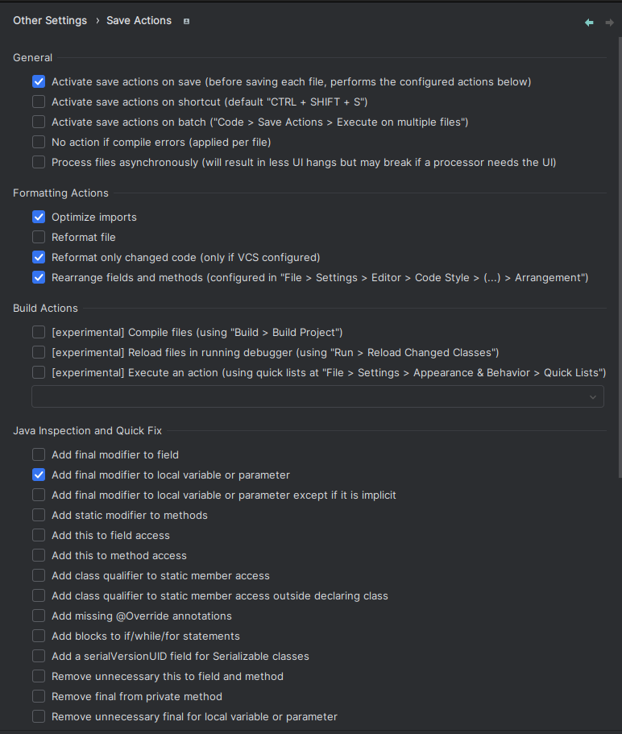
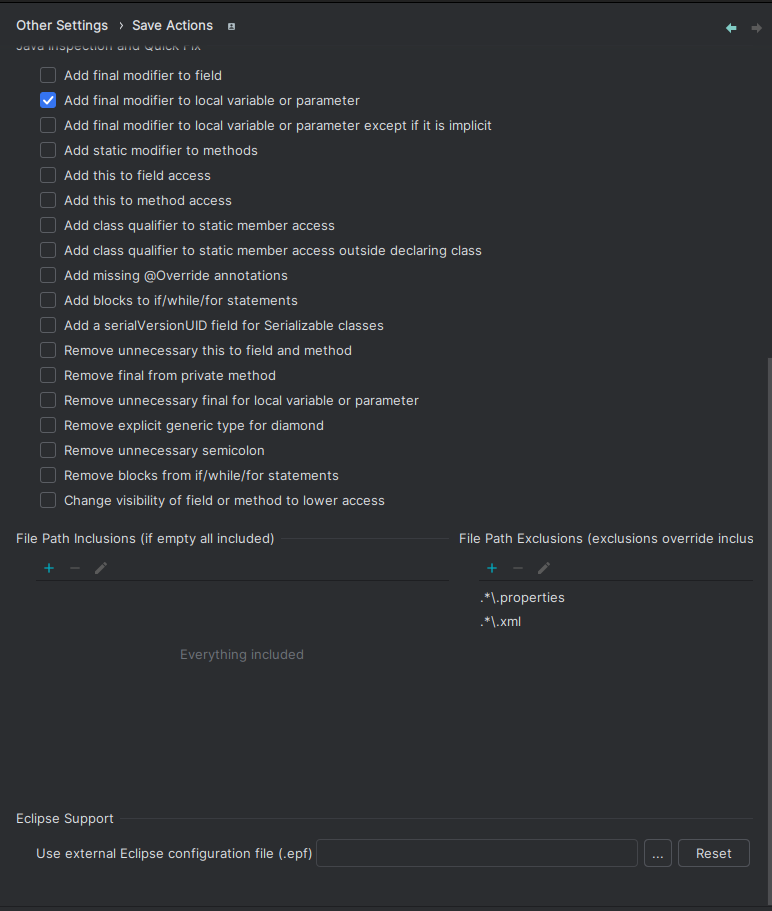
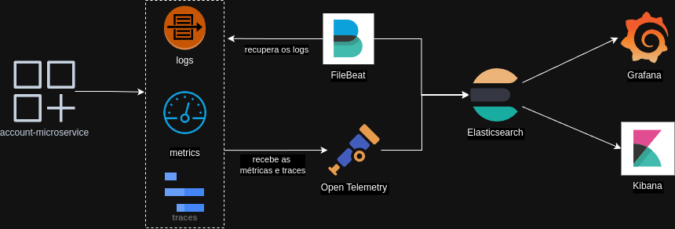

# Arquitetura Completa - POC

Este projeto é uma prova de conceito (POC) para demonstrar uma arquitetura completa de microserviços usando Spring Boot 3 e Java 21. O objetivo é mostrar como implementar microserviços em uma arquitetura moderna, incluindo APM, CI/CD com Argo CD, geração de imagem Docker, Istio, e verificação de código no CI.

## Módulos

O projeto está dividido em 3 módulos principais:

1. **Account** - Gerenciamento de contas.
2. **Transactions** - Processamento de transações financeiras.
3. **Statement** - Geração de extratos das contas.

* Além destes temos os migrations que foram separados para facilitar a manutenção e uso em CI/CD.
* Não foi utilizado diretamente o plugin maven do flyway, pois ele não consegue ler o arquivo .env, e quero evitar o uso
  de shell scripts de export para o env do sistema operacional local.

> Esta POC não tem como objetivo a implementação de código e regras de negócio seguindo todas as boas práticas. A
> implementação será feita de forma simplificada, com o intuito de demonstrar a arquitetura em si e seus recursos.

## Tecnologias Utilizadas

- **Java 21**
- **Spring Boot 3**
- **Docker(Pode-se usar o Postman)**
- **Istio**
- **Argo CD**
- **APM (Application Performance Monitoring)**
- **PostgreSQL**
- **Flyway**

## Estrutura do Projeto

```
microservice-architeture-poc/
│
├── account-microservice
├── account-microservice-migration
├── statement-microservice
├── statement-microservice-migration
├── transaction-microservice
└── transaction-microservice-migration               
```

## Etapas

### 1. Setup Inicial do Projeto

- [x] Criar um novo repositório no GitHub/GitLab.
- [x] Configurar um projeto Spring Boot 3 usando Java 21(21.0.4-amzn).
- [x] Definir o layout do projeto para múltiplos microserviços (Para a poc, monorepo).
- [x] Adicionar dependências básicas: Spring Web, Spring Data JPA, Spring Actuator, OTEL, etc.

### 2. Desenvolvimento dos Microserviços

- [ ] Possibilitar subida dos módulos
- [ ] Implementar os microservices básicos (ex.: Account, Transaction e Statement) com CRUD simples.
- [ ] Configurar comunicação entre microservices (REST APIs).
- [ ] Adicionar suporte ao banco de dados (H2 e Postgres) e configurar o repositório JPA.
- [ ] Implementar tratamento de erros.

### 3. Monitoramento (APM)

- [ ] Escolher uma ferramenta de APM (ex.: Prometheus + Grafana, Elastic APM).
- [ ] Adicionar dependências necessárias ao projeto.
- [ ] Configurar métricas no Spring Boot Actuator e integrar com o APM escolhido.

### 4. Containerização com Docker

- [ ] Criar Dockerfiles para cada microservice.
- [ ] Criar um docker-compose para subir todos os serviços localmente.
- [ ] Testar a execução dos microservices em containers Docker.

### 5. Configuração do CI/CD com Argo CD

- [ ] Configurar um pipeline de CI/CD (usando GitHub Actions, GitLab CI ou Jenkins).
- [ ] Integrar o pipeline com Argo CD para deploy automatizado.
- [ ] Configurar o Argo CD para monitorar o repositório e implementar os serviços em Kubernetes.
- [ ] Testar a pipeline de CI/CD desde a construção da imagem Docker até a implantação.

### 6. Implementação do Istio para Service Mesh

- [ ] Instalar Istio no cluster Kubernetes.
- [ ] Configurar a entrada do gateway do Istio para os microservices.
- [ ] Habilitar features do Istio: roteamento de tráfego, balanceamento de carga, circuit breaking.
- [ ] Monitorar a comunicação e o tráfego entre microservices via Istio.

### 7. Verificação de Código no CI

- [ ] Integrar ferramentas de análise de código (SonarQube, Checkstyle, SpotBugs) no pipeline.
- [ ] Configurar o pipeline para executar verificações de qualidade, testes unitários e cobertura de código.

### 8. Documentação

- [ ] Documentar as etapas de configuração e implantação.
- [ ] Criar guias para cada componente da arquitetura (APM, Docker, Istio, Argo CD).
- [ ] Incluir exemplos de chamadas de API para os microservices.

### 9. Testes Finais

- [ ] Testar a aplicação end-to-end com todos os componentes em execução.
- [ ] Validar a observabilidade através do APM e Istio.
- [ ] Simular cenários de falhas para testar a resiliência da arquitetura.

## Como Executar

**Nota:** Instruções detalhadas de execução serão adicionadas conforme o desenvolvimento do projeto.

1. Clone este repositório.
2. Navegue até o diretório do projeto.
3. Execute os comandos necessários para iniciar cada módulo (a ser detalhado).

## Padronização de Código

Este projeto utiliza os seguintes plugins no IntelliJ para padronizar a escrita de código Java:

1. **google-java-format**: Um plugin que aplica o formato de código oficial da Google para Java, garantindo que o código
   esteja sempre de acordo com os padrões estabelecidos pela Google.


2. **save actions**: Este plugin executa ações automaticamente ao salvar o arquivo, como aplicar formatação de código e
   outras regras configuradas. Ele é usado como um linter para padronizar a escrita do código.

Ambos os plugins estão configurados para garantir a consistência do estilo de código em todo o projeto. Certifique-se de
ter esses plugins instalados no seu IntelliJ para seguir o padrão de código do projeto.




## Ferramentas de APM

1. **Grafana**: Plataforma de visualização de dados que cria dashboards para métricas, logs e traces.


2. **Elasticsearch**: Motor de busca e análise distribuído que armazena e permite buscas rápidas em grandes volumes de logs.


3. **Logback**: Framework de logging que fornece logs estruturados para as aplicações.


4. **OpenTelemetry Collector**: Hub central para coleta, processamento e exportação de métricas, logs e traces para o Elasticsearch.


5. **Kibana**: Ferramenta de visualização que se conecta ao Elasticsearch para consulta e análise de logs e traces.


## Acesso às ferramentas de APM

> 1. **Grafana**

- **Acesso:** Abra o navegador e digite: [http://localhost:3000](http://localhost:3000).


- **Descrição:** Grafana é a plataforma de visualização para seus dados. Após acessar, faça login (as credenciais padrão são `admin`/`admin` na primeira vez) e configure painéis personalizados para monitorar suas métricas, logs e rastreamentos coletados pelo OpenTelemetry Collector e Elasticsearch.

> 2. **Kibana**

- **Acesso:** Abra o navegador e digite: [http://localhost:5601](http://localhost:5601).


- **Descrição:** Kibana permite a visualização e análise de logs e traces armazenados no Elasticsearch, possibilitando a criação de dashboards e a realização de pesquisas avançadas.

## Fluxo Simplificado de APM



1. **Aplicação Spring Boot**:

>   - Expõe métricas e telemetrias para o **OpenTelemetry Collector**.
>   - Gera logs estruturados com **Logback**, que são coletados pelo **Filebeat**.


2. **OpenTelemetry Collector**:

>   - Recebe traces e métricas da aplicação.
>   - Exporta:
      - **Traces** e **Métricas** para o **Elasticsearch**.

3. **Filebeat**:

>    - Busca logs das aplicações.
>    - Exporta:
        - **Logs** para o **Elasticsearch**.

3. **Elasticsearch**:
   
>   - Armazena os logs, métricas e traces para consulta.


4. **Grafana**:

>   - Conecta-se ao **Elasticsearch** para visualização de métricas e traces.
>   - Fornece dashboards unificados para análise.


5. **Kibana**:

>  - Se conecta ao **Elasticsearch** para consulta e visualização dos logs, métricas e traces coletados.

**Obs: Kibana e Grafana se complementam. Mas pode-se optar por apenas um dependendo da necessidade de observabilidade.**

## Configurações no Intellij

   - Crie um .env em cada projeto, deixando ele na raiz, junto com o arquivo docker-compose.yml

   ```
      Exemplo do env.dev:
      POSTGRESQL_USER=root
      POSTGRESQL_PASSWORD=root
      POSTGRESQL_DB=accountdb
      POSTGRESQL_PORT=5432
      POSTGRESQL_URL=jdbc:postgresql://localhost:5432/accountdb
      POSTGRESQL_SCHEMA=accountms
      OTEL_SERVICE_NAME=account-microservice
      LOG_PATH=/home/SEU_USUARIO/DIRETORIO_ONDE_CLONOU_O_PROJETO/microservice-architecture-poc/logs/account-microservice
   ```

   - Adicione o plugin para ler .env no IntteliJ (https://plugins.jetbrains.com/plugin/7861-envfile)
   - Quando der um **run** no projeto pelo IntelliJ, edite esse run e adicione no menu 'Modify Options' a opção 'Enable Env File'
   - Para adicionar o .env, clique no símbolo de '+' e selecione um arquivo docker.compose. O Plugin tem um bug e não deixa selecionar o .env devido a não ter um nome. Depois de carregado o arquivo docker, nomeie ele para 'account-microservice/.env'.

   - O **run configurations** de cada projeto ja esta salvo neste repositório e deve aparecer como ex: AccountMicroserviceApplication.

## Configurando o ElasticSearch

Após iniciar os serviços, acesse o Kibana em [http://localhost:5601](http://localhost:5601) e verifique:

...
